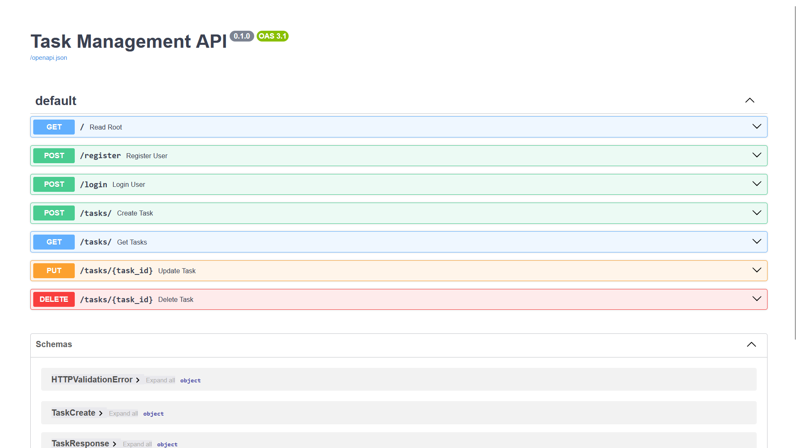

# TaskManagement API

A secure, modern **Task Management REST API** built with **FastAPI** and **Supabase**. Users can register, log in, and perform CRUD operations on their own tasks. Admin users can manage all tasks across all users.

Authentication is handled via Supabase Auth (JWT-based), and data access is protected by Row Level Security (RLS) policies at the database level — meaning even if the API layer were bypassed, users still couldn't read or modify tasks that don't belong to them.

---



---

## 📑 Table of Contents

- [Features](#-features)
- [Tech Stack](#-tech-stack)
- [Project Structure](#-project-structure)
- [Supabase Setup](#-supabase-setup)
- [Local Installation](#-local-installation)
- [Running the API](#-running-the-api)
- [API Endpoints](#-api-endpoints)
- [Example Requests](#-example-requests)
- [Notes](#-notes)
- [What I Learned](#-what-i-learned)
- [License](#-license)
- [Author](#-author)

---

## ✨ Features

- 🔐 **JWT authentication** via Supabase Auth (register + login endpoints)
- 📝 **Full CRUD** on tasks (create, read, update, delete)
- 🛡️ **Row Level Security** — users can only see and modify their own tasks
- 👑 **Admin mode** — designated admin emails can access all users' tasks
- 📅 **Due dates and completion status** for each task
- 📚 **Auto-generated API docs** via FastAPI's built-in Swagger UI at `/docs`

---

## 🧰 Tech Stack

| Component | Purpose |
|---|---|
| **Python 3.9+** | Language |
| **FastAPI** | Web framework |
| **Supabase** | Postgres database + Auth |
| **supabase-py** | Official Supabase Python client |
| **Pydantic v2** | Request/response validation |
| **Uvicorn** | ASGI server |
| **python-dotenv** | Environment variable loader |

---

## 📁 Project Structure
```
TaskManagement/
├── main.py              # FastAPI app + all endpoints
├── database.py          # Supabase client initialization
├── schemas.py           # Pydantic models (TaskCreate, TaskUpdate, TaskResponse)
├── requirements.txt     # Python dependencies
├── .env.example         # Template for environment variables
├── .env                 # Your local secrets (NOT committed to git)
└── .gitignore
```

### What each file does

- **`main.py`** — Defines the FastAPI application and all route handlers (`/register`, `/login`, `/tasks/`, etc.). Contains the `get_current_user` dependency that validates the JWT on every protected endpoint, and the admin-email logic that switches between the regular client and the service-role client.
- **`database.py`** — Loads environment variables and creates two Supabase clients: `supabase` (uses the anon key, respects RLS) and `supabase_admin` (uses the service role key, bypasses RLS — only used for admin users).
- **`schemas.py`** — Pydantic models that define the shape of incoming requests and outgoing responses. Separates `TaskCreate` (what users send to create a task), `TaskUpdate` (partial updates), and `TaskResponse` (what the API returns).

---

## 🗄️ Supabase Setup

You'll need a Supabase project before you can run this API. Follow these steps carefully:

### 1. Create a new Supabase project

1. Go to [supabase.com](https://supabase.com) and sign in
2. Click **New Project**
3. Choose a name, set a strong database password (save it somewhere), pick a region close to you
4. Wait 1–2 minutes for the project to spin up

### 2. Create the `tasks` table

Open the **SQL Editor** in the left sidebar, click **New query**, paste the following and click **Run**:
```sql
CREATE TABLE public.tasks (
    id UUID PRIMARY KEY DEFAULT gen_random_uuid(),
    user_id UUID NOT NULL REFERENCES auth.users(id) ON DELETE CASCADE,
    title TEXT NOT NULL,
    description TEXT,
    due_date TIMESTAMPTZ,
    is_completed BOOLEAN NOT NULL DEFAULT FALSE,
    created_at TIMESTAMPTZ NOT NULL DEFAULT NOW()
);
```

### 3. Enable Row Level Security and add policies

Still in the SQL Editor, run:
```sql
-- Enable RLS on the tasks table
ALTER TABLE public.tasks ENABLE ROW LEVEL SECURITY;

-- Users can SELECT their own tasks
CREATE POLICY "Users can view their own tasks"
ON public.tasks FOR SELECT
TO authenticated
USING (auth.uid() = user_id);

-- Users can INSERT tasks for themselves
CREATE POLICY "Users can create their own tasks"
ON public.tasks FOR INSERT
TO authenticated
WITH CHECK (auth.uid() = user_id);

-- Users can UPDATE their own tasks
CREATE POLICY "Users can update their own tasks"
ON public.tasks FOR UPDATE
TO authenticated
USING (auth.uid() = user_id)
WITH CHECK (auth.uid() = user_id);

-- Users can DELETE their own tasks
CREATE POLICY "Users can delete their own tasks"
ON public.tasks FOR DELETE
TO authenticated
USING (auth.uid() = user_id);
```

These four policies ensure that authenticated users can only see and modify rows where `user_id` matches their own auth UID. The admin client (`supabase_admin`) uses the service role key, which bypasses these policies.

### 4. Configure Auth settings

Go to **Authentication → Providers → Email**:

- Make sure **Email provider** is enabled
- For local development/testing, you may want to **disable "Confirm email"** so new users can log in immediately without clicking a confirmation link. For production, keep it enabled.

Alternatively, you can manually create users with auto-confirmation via **Authentication → Users → Add user** and checking the **"Auto Confirm User"** box.

### 5. Grab your API credentials

Go to **Project Settings (⚙️) → API**. You'll need three values:

- **Project URL** — e.g. `https://xxxxx.supabase.co`
- **`anon` `public` key** — the publishable key, safe for client-side use
- **`service_role` `secret` key** — ⚠️ **KEEP THIS SECRET**, it bypasses all RLS

Save these for the next step.

---

## 💻 Local Installation

### 1. Clone the repository
```bash
git clone https://github.com/keremcdm/TaskManagement.git
cd TaskManagement
```

### 2. Create and activate a virtual environment

**Windows (PowerShell):**
```bash
python -m venv .venv
.venv\Scripts\activate
```

**macOS / Linux:**
```bash
python -m venv .venv
source .venv/bin/activate
```

### 3. Install dependencies
```bash
pip install -r requirements.txt
```

### 4. Configure environment variables

Copy the example file and fill in your Supabase credentials:
```bash
cp .env.example .env
```

Then edit `.env`:
```env
SUPABASE_URL=https://your-project-ref.supabase.co
SUPABASE_KEY=your_anon_public_key_here
SUPABASE_ADMIN_KEY=your_service_role_secret_key_here
ADMIN_EMAILS=youradmin@example.com,anotheradmin@example.com
```

- `SUPABASE_URL` — Project URL from step 5 above
- `SUPABASE_KEY` — the **anon public** key
- `SUPABASE_ADMIN_KEY` — the **service_role secret** key
- `ADMIN_EMAILS` — comma-separated list of emails that should have admin privileges (can see and modify ALL users' tasks)

---

## 🚀 Running the API

From the project root with your virtual environment activated:
```bash
uvicorn main:app --reload
```

The API will be available at **http://127.0.0.1:8000**.

Interactive API documentation (Swagger UI) is auto-generated at **http://127.0.0.1:8000/docs** — you can test all endpoints directly from your browser.

---

## 📡 API Endpoints

| Method | Endpoint | Auth Required | Description |
|---|---|---|---|
| `GET` | `/` | No | Health check |
| `POST` | `/register` | No | Register a new user |
| `POST` | `/login` | No | Log in, returns a JWT access token |
| `POST` | `/tasks/` | Yes | Create a new task |
| `GET` | `/tasks/` | Yes | List tasks (own tasks, or all if admin) |
| `PUT` | `/tasks/{task_id}` | Yes | Update a task |
| `DELETE` | `/tasks/{task_id}` | Yes | Delete a task |

Protected endpoints require the access token from `/login` in an `access-token` header.

---

## 📬 Example Requests

### Register a new user
```bash
curl -X POST http://127.0.0.1:8000/register \
  -H "Content-Type: application/json" \
  -d '{"email": "user@example.com", "password": "supersecret123"}'
```

Response:
```json
{ "message": "User registered successfully!" }
```

### Log in
```bash
curl -X POST http://127.0.0.1:8000/login \
  -H "Content-Type: application/json" \
  -d '{"email": "user@example.com", "password": "supersecret123"}'
```

Response:
```json
{ "access_token": "eyJhbGciOiJIUzI1NiIsInR5cCI6IkpXVCJ9..." }
```

Save this token — you'll need it for all subsequent requests.

### Create a task
```bash
curl -X POST http://127.0.0.1:8000/tasks/ \
  -H "Content-Type: application/json" \
  -H "access-token: eyJhbGciOiJIUzI1NiIsInR5cCI6IkpXVCJ9..." \
  -d '{
    "title": "Finish internship project",
    "description": "Complete the TaskManagement API and write a good README",
    "due_date": "2026-04-15T23:59:00Z"
  }'
```

Response:
```json
{
  "id": "a1b2c3d4-...",
  "user_id": "f9e8d7c6-...",
  "title": "Finish internship project",
  "description": "Complete the TaskManagement API and write a good README",
  "due_date": "2026-04-15T23:59:00Z",
  "is_completed": false,
  "created_at": "2026-04-06T14:52:00Z"
}
```

### List your tasks
```bash
curl -X GET http://127.0.0.1:8000/tasks/ \
  -H "access-token: eyJhbGciOiJIUzI1NiIsInR5cCI6IkpXVCJ9..."
```

Regular users see only their own tasks. Admin users (emails listed in `ADMIN_EMAILS`) see every task from every user.

### Update a task
```bash
curl -X PUT http://127.0.0.1:8000/tasks/a1b2c3d4-... \
  -H "Content-Type: application/json" \
  -H "access-token: eyJhbGciOiJIUzI1NiIsInR5cCI6IkpXVCJ9..." \
  -d '{"is_completed": true}'
```

Only the fields you include are updated (partial update). Response is the full updated task.

### Delete a task
```bash
curl -X DELETE http://127.0.0.1:8000/tasks/a1b2c3d4-... \
  -H "access-token: eyJhbGciOiJIUzI1NiIsInR5cCI6IkpXVCJ9..."
```

Response:
```json
{ "message": "Task deleted" }
```

---

## 📝 Notes

- **JWT tokens expire** — Supabase access tokens are valid for 1 hour by default. If you get a `401 Invalid or expired token` error, log in again to get a fresh token.
- **Admin access is email-based** — any user whose email appears in `ADMIN_EMAILS` automatically gets admin privileges on login. There's no separate admin role in the database.
- **RLS is enforced at the database level** — even if someone bypasses the API and queries Supabase directly with the anon key, they can only see rows where `user_id = auth.uid()`. The only way to see everything is via the service role key, which stays on the server.
- **Never commit `.env`** — `.env` is listed in `.gitignore`. If you ever accidentally commit your service role key, rotate it immediately from Supabase Dashboard → Project Settings → API.

---

## 🎓 What I Learned

Building this project taught me a lot about real-world backend development:

- **JWT authentication end-to-end** — from issuing tokens on login to validating them on every protected request
- **Row Level Security at the database layer** — how to enforce per-user data isolation independently of application code, so even a bug in the API can't leak data between users
- **The difference between anon and service-role keys** — when each is appropriate and why the service role key must never leave the server
- **Structuring a FastAPI project** — clean separation between routing (`main.py`), database access (`database.py`), and request/response validation (`schemas.py`)
- **Pydantic for validation** — using separate models for create, update, and response to keep the API contract explicit
- **Security basics** — keeping secrets in `.env`, using `.gitignore` properly, and the importance of rotating leaked credentials

---

## 📄 License

This project is licensed under the MIT License — see the [LICENSE](LICENSE) file for details.

---

## 👤 Author

**Kerem Çidem**
Computer Engineering Student at Politecnico di Torino

[](https://github.com/keremcdm)
[](https://www.linkedin.com/in/keremcidem/)
